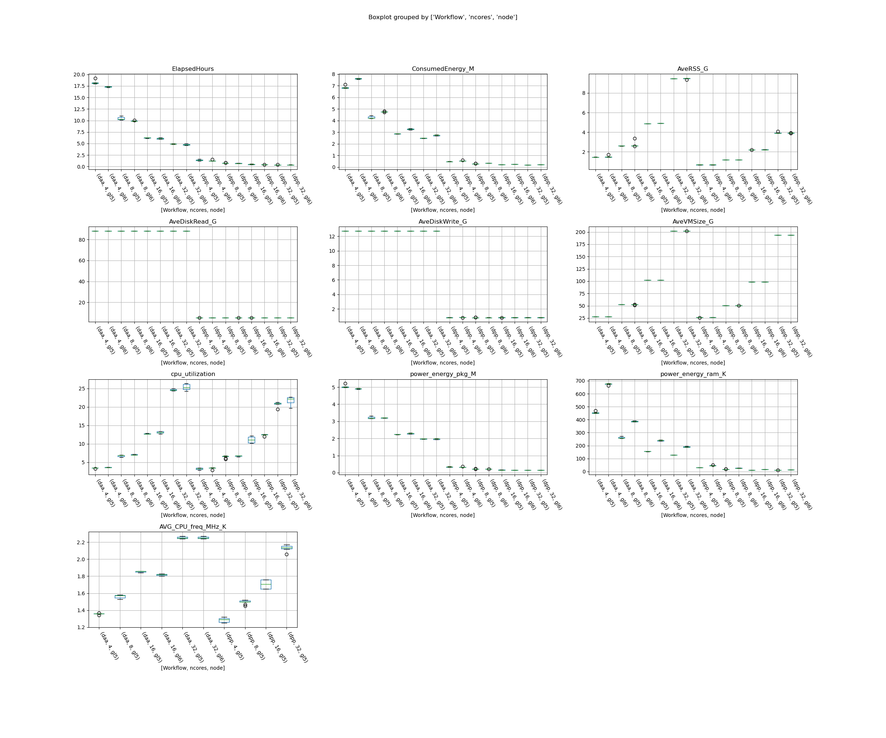

# Energy Consumption of Haddock Modes and Parameters

## Description

Tool for managing and monitoring [HADDOCKv3](https://github.com/haddocking/haddock3/blob/v3.0.0-beta.5) experiments
efficiently.

## CLI Usage

Please refer to [this guide](./cli/README.md) for detailed information on how to use the CLI tool.

## Graph examples

### Energy Consumption

## DAA workflow: Average cpu utilization for every vCPU

